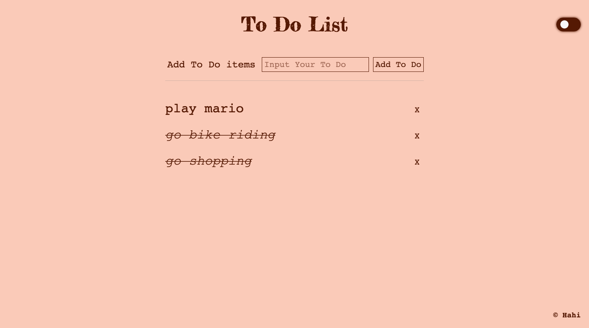

# Todo app

This is a todo app build with vanilla JavaScript

## Setup

Make sure you have node installed, then run `npm install`

## Run locally

To run the project locally run `npm dev`.

You can then open the project on [http://127.0.0.1:8080](http://127.0.0.1:8080) in the browser.
